# Анализ поведения пользователей на сайте «СберАвтоподписка»

## Цель проекта

Разработка модели, предсказывающей вероятность того, что пользователь совершит **целевое действие** на сайте «СберАвтоподписка» (оставит заявку, закажет звонок и т.д.), на основе сессионных данных из Google Analytics.

**Функционал модели:**
- Оценка эффективности каналов трафика;
- Выявление поведенческих и технических признаков, связанных с конверсией;
- Вывод предсказания в веб-интерфейс для использования специалистами по маркетингу и UX.

**Планируемый Результат:**
модель бинарной классификации (целевое действие - да/нет), оцениваемая по метрике ROC-AUC.

---

## Данные

**Проект основан на двух источниках:**

1. ga_sessions.pkl - информация о визитах на сайт: описывают, кто, когда и откуда пришёл на сайт, через какой канал, с какого устройства.
Каждая строка - одна сессия (визит) пользователя 

Поля:
session_id, client_id, visit_date, visit_time, visit_number — идентификаторы и метки времени;
utm_* (source, medium, campaign, keyword) — рекламные источники (каким каналом пришёл);
device_* — характеристики устройства (тип, ОС, браузер, модель и т.п.);
geo_* — география пользователя (страна, город).

2. ga_hits.pkl — события внутри сессий: что делал пользователь во время визита, и произошло ли целевое действие.

Строка = одно действие пользователя в рамках одной сессии. 
Поля:
session_id, hit_date, hit_time, hit_number — идентификаторы и время события;
hit_type, hit_page_path, hit_referer — тип действия и путь страницы;
event_category, event_action, event_label, event_value — навигационные, кликовые, целевые действия (пример: нажатие на кнопку, просмотр формы, оформление заявки и т.п.).

**Целевая переменная (`target`)** создаётся на основе события: если в сессии присутствует одно из целевых действий. В качестве целевых действий выбраны события в ga_hits.pkl по полям event_category и event_action.
Примеры целевых действий:
- submit_form
- request_callback
- send_application
- order_button_click
- lead_conversion
- thank_you_page_view

**Логика выбора целевых действий и их связи с признаками:**

Каждое целевое действие (ЦД) - это результат взаимодействия пользователя с сайтом, каждое из них складывается из того, откуда он пришёл (так мы понимаем его мотивы - зачем заходил), с чего заходил (что-то без разницы на чём делать - на смартфоне или ПК, а что-то удобно делать только с десктопа), в какое время (например, посмотрел коротко в обеденный перерыв или нормально обстоятельно смотрел в свободное время вечером, может влиять регион (разный образ жизни, привычки, доступные ресурсы и т.д.). Мы предполагаем, что тот статус, который оказался записанным в event_action - это не случайность, а связано с тем, что пользователь делал до того, как ему был присвоен этот статус. Ниже описание гипотез, которые могут подтвердиться или нет (или мы получим другие пары ЦД и параметров, которые обнаружит моделька сама (например, CatBoost или LightGBM).

Подходящие ЦД, взятые из event_action:
1. submit_form (отправка формы на сайте) - влияет повторный это визит или первый, откуда пришёл (из рекламы или по прямой ссылке, т.к. уже знал её и бывал на сайте), с мобилки или деска (если форма большая, или в неё надо копировать и вставлять данные, то не будут заполнять с мобилки) - т.е. ожидаем, что на submit_form влияют:
- источник - utm_source, utm_medium
- девайс - device_*
- инфо о визите - visit_number
- гео - geo_*
2. request_callback (запрос обратного звонка) - например, может потребоваться
для финального принятия решения (не первый визит) - visit_number, 
если низкая комп. грамотность (извините, в регионах - geo_* или device_category)
как-то опосредованно будет связь с источниками визита utm_*.
3. order_button_click (заявка/заказ - инициирование, вызов формы для заполнения, которую может заполнить и отправить, а может - нет. Например, мог увидеть, что надо телефон или email оставить и решил не продолжать, или решил отложить)
- заполнил форму вечером в свободное время или в выходные - visit_*
- источник влияет - utm_*
- у человека просто деньги есть (device_category, device_brand, device_model, device_screen_resolution).
4. send_application (непосредственно заявка/заказ - заполнил форму, если она на сайте/в воронке есть, и отправил)
- может быть по спец предложению/промо/акции из рекламы или email (utm_*),
- деньги появились (visit_number + тоже utm_*, например, зашёл по прямой ссылке)
- долго думал и решился (visit_number, visit_time).
5. lead_conversion - этот пользователь нам уже знаком и есть история предыдущего взаимодействия (например, лид зашёл когда-то случайно из рекламы, тут вернулся - мы его узнали и дальше отслеживаем его действия - тут - могут сыграть любые признаки в любой комбинации).
- thank_you_page_view (человек перешёл на финальную страницу “Спасибо за заказ”, например, он не только оформил заказ, но ещё и оплатил его - т.е. дошёл до конца воронки) - тоже могут сказаться буквально все признаки, т.к. сюда могут дойти пользователи из любого сценария.

---

## Этапы реализации
1. Анализ и очистка данных
2. Визуализация и EDA
3. Выбор и реализация предсказательной модели   
5. Реализация предсказательной модели.

---

### Этапы 1-2. Анализ и очистка данных. Визуализация и EDA

Выполнено:
- Загрузка и изучение структуры `ga_sessions` и `ga_hits`;
- Обнаружение и обработка пропусков, дубликатов, аномалий;
- Объединение таблиц по `session_id`;
- Разметка целевой переменной `target`;
- Исследование категориальных признаков с большим количеством уникальных значений.
- Распределения по каналам трафика, устройствам, ОС, географии;
- Анализ числовых признаков (`visit_number`, `event_value`);
- Корреляционная матрица;
- Исследование признаков в разрезе `target`.

**Выводы по анализу данных**

1. Структура и полнота данных в целом удовлетворительная:
- Пропуски и некорректные значения встречаются локально (например, в utm_keyword, utm_campaign), но не критичны.
- Числовые и категориальные типы данных определены корректно, дубликатов не обнаружено.
- Данные по ga_sessions и ga_hits успешно объединены через session_id.

2. Целевая переменная (target) успешно размечена на основе событий:
- Использованы события event_action вроде submit_form, request_callback, lead, order_button_click.
- Баланс классов смещён в сторону 0, но уровень несбалансированности приемлем (примерно 1:4–1:5).

3. Распределения категориальных признаков показывают высокую неоднородность:
- Некоторые признаки (например, utm_source, device_category, device_os) имеют ограниченное число популярных значений;
- Другие (например, geo_city, utm_campaign) содержат десятки и сотни уникальных значений, что потребует группировки или encoding.


4. Числовые признаки содержат полезную информацию для модели:
- Признак visit_number имеет правостороннее распределение, что может сигнализировать о важности "постоянных" пользователей.
- Значения event_value сконцентрированы в нуле, но отдельные сессии демонстрируют аномально высокие значения — требуют отдельной обработки или логарифмирования.

Распределение признаков

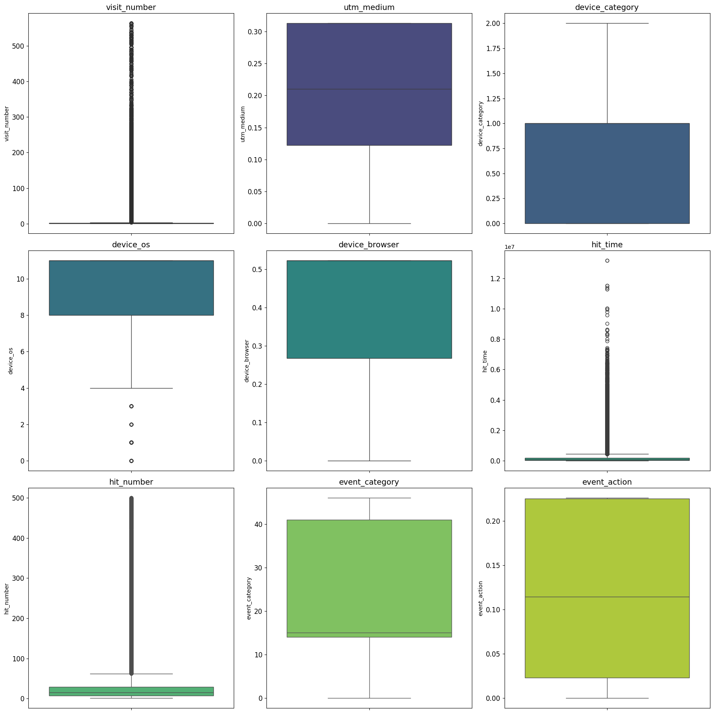


5. Корреляционный анализ выявил слабые связи между числовыми признаками:
Корреляции между visit_number, event_value и target не высоки по модулю, но подтверждают, что влияние лучше выявлять нелинейными моделями.

График: корреляционная матрица (heatmap)

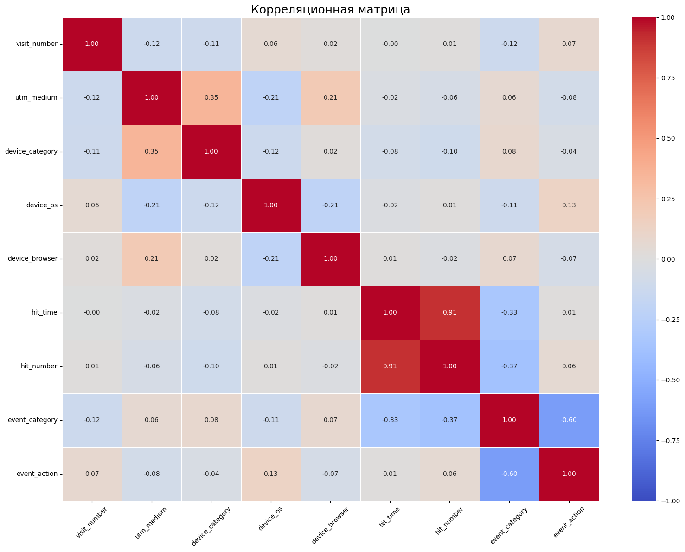

7. Предварительный EDA подтвердил обоснованность гипотез:
- Тип устройства, канал привлечения и город посещения влияют на вероятность совершения целевого действия;
- Некоторые источники (utm_source) и типы устройств (device_category) явно связаны с более высокой конверсией.

**Комментарии по отдельным характерным свойствам данных**

**1. География пользователей**

Почти все сессии происходят из России — признак geo_country не несёт разнообразной информации. Его можно упростить до Russia / Other.

График: TOP 10: geo_country — резкий перевес в сторону одного значения.
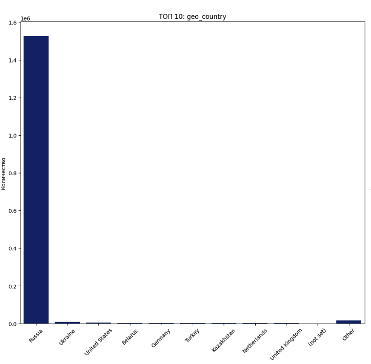

**2. Тип устройства, ОС и бренд**

- Большинство пользователей заходят с мобильных устройств (device_category);
- Доминирующие ОС — вероятно, Android/iOS;
- Популярные бренды: Apple, Samsung, Xiaomi;
- Все переменные потенциально важны для UX и маркетинговых гипотез.

Графики:
TOP 10: device_category — явное преобладание категории 1 (мобильные). TOP 10: device_os — распределение по ОС.
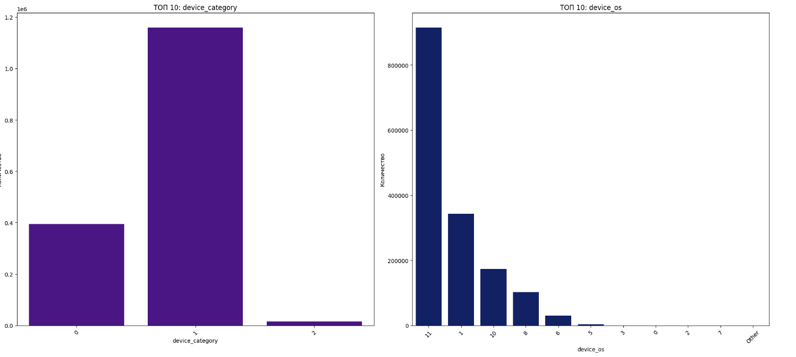

TOP 10: device_brand — визуальное распределение брендов. TOP 10: device_browser — покрытие браузеров (влияет на поведение и интерфейс).
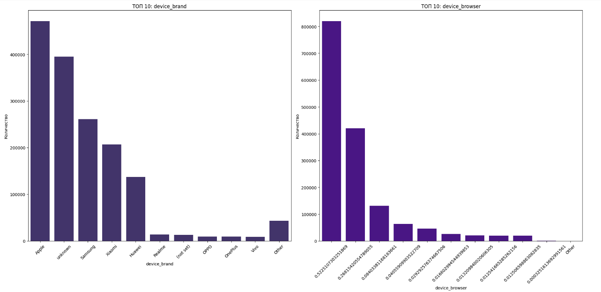


**3. Поведение в сессии (действия и события)**

В действиях пользователей (event_action, event_category) есть сильные лидеры и длинный "хвост" редких значений;

- Есть смысл выделить Top-N значений и заменить остальные на Other;
- Поведение разнообразно, но концентрировано вокруг нескольких типов событий.

Графики:

TOP 10: event_action — два пиковых действия + множество редких;
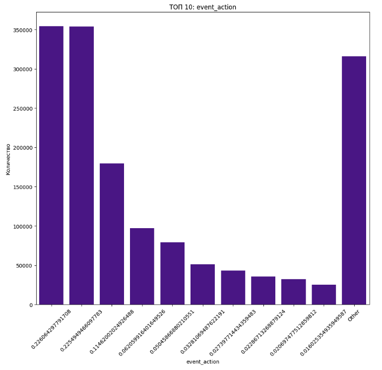

TOP 10: event_category — один лидер и постепенное снижение;
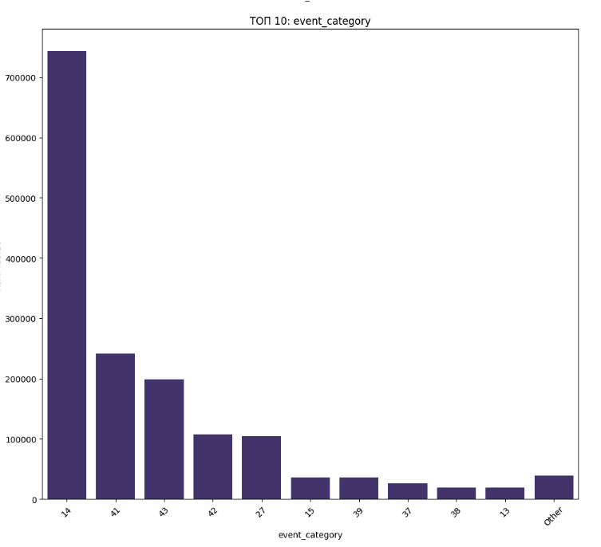

Boxplot event_action и event_category подтверждают небольшую дисперсию у популярных значений.
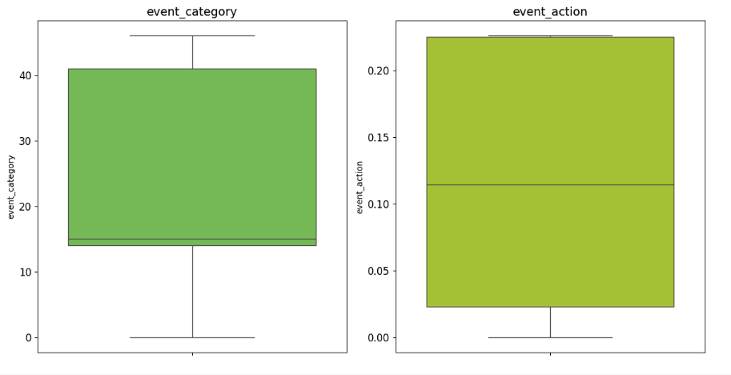

**4. Источники и каналы трафика**

- Кампании (utm_campaign), источники (utm_source), содержимое объявлений (utm_adcontent) и каналы (utm_medium) демонстрируют сильную неравномерность;
- Преобладают 1–3 значения, остальное — шум;
Это ключевые бизнес-признаки, важно сохранить их семантическую ценность, применив Top-N.

График:

TOP 10: utm_source, utm_medium, utm_campaign, utm_adcontent — выраженные пики и длинные "хвосты".
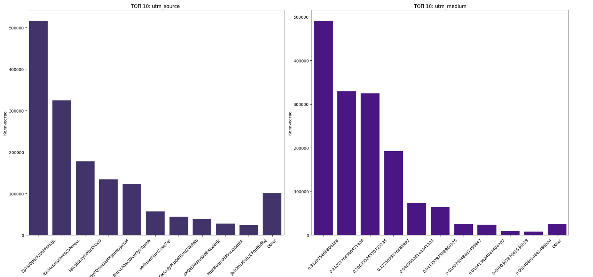
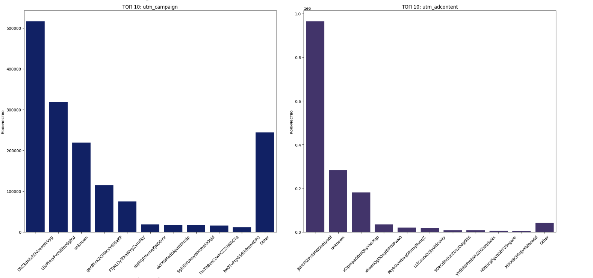


**5. Технические признаки сессии и активности**

- Признаки visit_number, hit_number, hit_time сильно скошены вправо;
- Много выбросов, но это может быть связано с реальным поведением "лояльных" пользователей.

Графики:

Boxplot visit_number, hit_number и hit_time наглядно демонстрируют выбросы и скошенность.
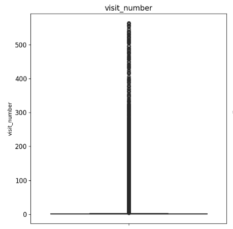
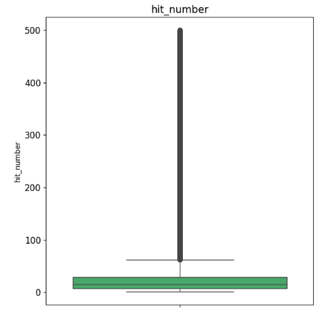
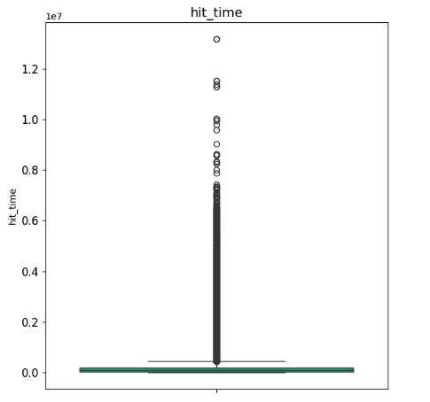


---

### Этапы 3-4. Выбор и реализация предсказательной модели

Этапы 3-4 включают
- Выбор и реализацию модели. В рамках проекта мы строим модель с использованием бустинга, т.к. CatBoost показывает наилучшее качество без сложной обработки признаков;
- ROC-AUC и baseline accuracy;
- Финальная модель сохранена в `model.pkl`.

Мы выбрали две архитектуру модели CatBoost с использованием категориальных признаков без кодирования (для быстрой реализации и интерпретируемости) - модель позволяет использовать признаки в полном исходном виде и тем самым учесть большое количество категорий.

Работающий фрагмент решения (код) можно найти по ссылке: [Uchebnaya_zadacha_komanda_4.ipynb](Uchebnaya_zadacha_komanda_4.ipynb)

---

### Алгоритм - CatBoost (градиентный бустинг)

В рамках проекта выбрана модель "CatBoostClassifier", поскольку она эффективно работает с категориальными признаками без необходимости ручного кодирования и демонстрирует высокое качество на задачах с дисбалансом классов.

**1. Поддержка категориальных признаков "из коробки" - категориальные признаки передаются напрямую как есть**
  Используется CatBoost с автоматической обработкой - модель обрабатывает категориальные переменные без необходимости ручного кодирования (one-hot, target encoding и т.д.), что позволяет избежать разрастания размерности и ошибок в обработке признаков.

**2. Устойчивость к переобучению и к дисбалансу классов**
  CatBoost автоматически регулирует регуляризацию и может справляться с задачами, где один класс преобладает (что характерно для нашего target).

**3. Высокое качество на малых и средних выборках**
  Учитывая ограниченный объём сессий (~десятки тысяч), CatBoost обеспечивает стабильную производительность даже без гиперпараметрического тюнинга.

**4. Интерпретируемость**
  Модель позволяет анализировать важность признаков, что даёт полезную бизнес-информацию.

**Обучение модели CatBoost**


Установка и импорты

```python
!pip install catboost
```

```python
from catboost import CatBoostClassifier
from sklearn.model_selection import train_test_split, RandomizedSearchCV
from sklearn.metrics import roc_auc_score
```


Формирование целевого признака

```python
target_actions = [
    "form_request_call_sent", "callback_requested", "sub_submit_success",
    "sub_callback_submit_click", "click_on_request_call", "click_free_car_selection",
    "click_buy_auto", "user_gave_contacts_during_chat", "chat_requested",
    "client_initiate_chat", "success_card_action", "success_id_creation",
    "sub_car_request_submit_click", "sub_custom_question_submit_click"
]

df_merge["target"] = df_merge["event_action"].isin(target_actions).astype(int)
```

Создаётся бинарный признак: `1`, если пользователь совершил целевое действие (например, заказал звонок или оставил заявку), и `0` — в противном случае.


Подготовка признаков

```python
features = [
    "visit_number", "utm_source", "utm_medium", "utm_campaign", "utm_adcontent",
    "utm_keyword", "device_category", "device_os", "device_brand",
    "device_screen_resolution", "device_browser", "geo_country",
    "geo_city", "hit_time", "hit_number"
]

df_model = df_merge[features + ['target']].dropna()
X = df_model[features]
y = df_model['target']
```


Обработка категориальных признаков

```python
cat_features = X.select_dtypes(include=['object', 'category']).columns.tolist()

for col in cat_features:
    X[col] = X[col].astype(str)
```


Разделение на обучающую и тестовую выборки

```python
X_train, X_test, y_train, y_test = train_test_split(X, y, stratify=y, random_state=42)
```


Обучение модели CatBoost

```python
best_params = {
    'scale_pos_weight': 3,
    'random_strength': 1,
    'learning_rate': 0.1,
    'l2_leaf_reg': 1,
    'iterations': 300,
    'depth': 4,
    'border_count': 128,
    'bagging_temperature': 0.1
}

model = CatBoostClassifier(
    **best_params,
    cat_features=cat_features,
    eval_metric="AUC",
    verbose=100,
    random_state=42
)

model.fit(X_train, y_train, eval_set=(X_test, y_test), use_best_model=True)

y_pred_proba = model.predict_proba(X_test)[:, 1]
print(f"ROC-AUC: {roc_auc_score(y_test, y_pred_proba):.4f}")
```


Сохранение модели

```python
import pickle
with open("model.pkl", "wb") as f:
    pickle.dump(model, f)
```


---

## Web-приложение для прогнозирования

Приложение позволяет ввести параметры сессии вручную и получить прогноз вероятности конверсии. Используется обученная модель `CatBoost`.
Протестировать приложение можно по адресу: http://194.87.252.54:8501/

### Технологический стек

- **Язык программирования:** Python 3.10+
- **Фреймворк:** [Streamlit](https://streamlit.io/) — легковесное средство для быстрой сборки интерактивных веб-прототипов и интерфейсов.
- **ML-модель:** CatBoostClassifier, обученная на признаках сессий и действий пользователей.
- **Формат модели:** сериализована в файл `model.pkl` с использованием модуля `pickle`.
- **Ввод данных:** форма, состоящая из числовых полей, выпадающих списков и текстовых строк с базовой валидацией.

### Логика работы приложения

**Загрузка модели**
   - При запуске `app.py` из файла `model.pkl` подгружается обученная модель CatBoost.
   - Входные данные подготавливаются для модели машинного обучения с помощтю transform.py. 
   - Загрузка выполняется один раз при старте сессии:
     ```python
     with open(\"model.pkl\", \"rb\") as f:
         model = pickle.load(f)
     ```
### Ввод пользовательских данных
**Данные для прогноза**
   - Интерфейс формируется с помощью компонентов Streamlit:
     - `st.selectbox()` — для категориальных признаков (например, `utm_source`, `device_os`)
     - `st.text_input()` — для текстовых или закодированных значений
     - `st.text_input()` с проверкой на ввод только числовых значений — для числовых признаков (`visit_number`, `hit_number`)
   - Пример:
     ```python
     utm_source = st.selectbox(\"Источник трафика\", [\"google\", \"direct\", \"yandex\", \"other\"])
     visit_number = st.number_input(\"Номер визита\", min_value=1, value=1)
     ```

**Вводимые параметры:**
1. Номер визита клиента
2. Источник и тип трафика
3. Кампания и объявление
4. Ключевое слово
5. Тип устройства, ОС, бренд
6. Разрешение и браузер
7. Страна и город
8. Время и номер происхождения события

### Интерфейс:
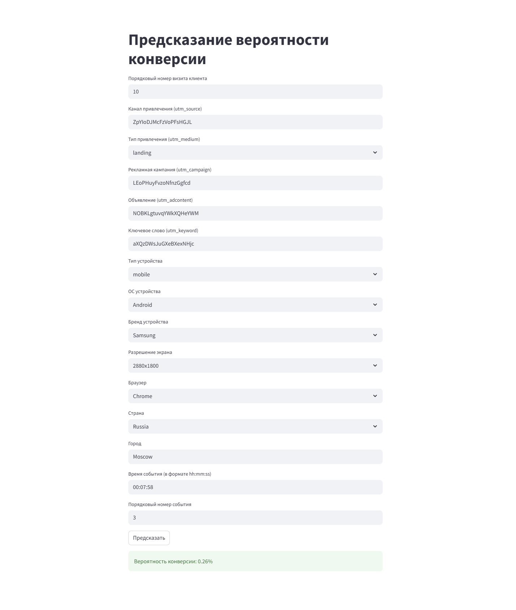

Пример вывода:
> Вероятность конверсии: **0.26%**

---

### Запуск проекта на VPS

**1. Подготовка окружения**

***1.1. Обновление системы***
```bash
sudo apt update && sudo apt upgrade -y
```

***1.2. Установка Python и pip***
```bash
sudo apt install python3 python3-pip -y
```

***1.3. Установка virtualenv***
```bash
pip3 install virtualenv
```

***1.4. Создание и активация виртуального окружения***
```bash
cd ~/my_streamlit_app
virtualenv venv
source venv/bin/activate
```

***1.5. Установка зависимостей***
```bash
pip install -r requirements.txt
```

***Файл requirements.txt***
streamlit
pandas
catboost


**2. Первичный запуск приложения**

***1.1. Обновление системы***
```bash
streamlit run app.py
```

**Файл Streamlit-приложения для прогноза по 15 признакам**
```python

import streamlit as st
import pandas as pd
import joblib
import datetime
from transform import transform_input

model = joblib.load("model.pkl")

st.title("Предсказание вероятности конверсии")

# Ввод номера визита как текст с проверкой
visit_number_input = st.text_input("Порядковый номер визита клиента", value="1", placeholder="Введите число от 1 до 1000")

# Проверка корректности и преобразование
try:
    visit_number = int(visit_number_input)
    if not (1 <= visit_number <= 1000):
        st.error("Введите число от 1 до 1000.")
        visit_number = None
except ValueError:
    st.error("Введите целое число.")
    visit_number = None

utm_source = st.text_input("Канал привлечения (utm_source)", value="unknown", placeholder="Введите название источника трафика")
utm_medium = st.selectbox("Тип привлечения (utm_medium)", ["(none)", "app", "article", "banner", "blogger_channel", "blogger_header", "blogger_stories", "cbaafe", "catalogue", "clicks", "cpa", "cpc", "cpv", "cpm", "dom_click", "email", "fb_smm", "google_cpc", "info_text", "landing", "landing_interests", "last", "link", "linktest", "main_polka", "medium", "nkp", "ok_smm", "organic", "outlook", "partner", "post", "promo_sber", "push", "qrcodevideo", "qr", "reach", "referral", "sber_app", "smm", "smartbanner", "sms", "social", "static", "stories", "tablet", "tg", "users_msk", "vk_smm", "yandex_cpc", "Other"])
utm_campaign = st.text_input("Рекламная кампания (utm_campaign)", value="unknown", placeholder="Введите название кампании")
utm_adcontent = st.text_input("Объявление (utm_adcontent)", value="unknown", placeholder="Введите содержание")
utm_keyword = st.text_input("Ключевое слово (utm_keyword)", value="unknown", placeholder="Введите ключевое слово")

device_category = st.selectbox("Тип устройства", ['mobile', 'tablet', 'desktop'])
device_os = st.selectbox("ОС устройства", ["unknown", "Android", "BlackBerry", "Chrome OS", "Firefox OS", "iOS", "Linux", "MacOS", "Nokia", "Samsung", "Tizen", "Windows", "Windows Phone", "Other"])
device_brand = st.selectbox("Бренд устройства", ["unknown", "Apple", "Asus", "Google", "Huawei", "LG", "Lenovo", "Nokia", "OnePlus", "OPPO", "Realme", "Samsung", "Sony", "Vivo", "Xiaomi", "Other"])
device_screen_resolution = st.selectbox("Разрешение экрана", ["unknown", "320x568", "360x640", "375x667", "375x812", "390x844", "412x915", "414x896", "430x932", "768x1024", "800x1280", "820x1180", "1024x1366", "1280x720", "1280x800", "1360x768", "1366x768", "1440x900", "1536x864", "1600x900", "1620x1080", "1680x1050", "1920x1080", "1920x1200", "2048x1080", "2160x1440", "2256x1504", "2304x1440", "2560x1440", "2736x1824", "2880x1800", "3000x2000", "3840x2160", "other"])
device_browser = st.selectbox("Браузер", ["(none)", "Android Webview", "Chrome", "Edge", "Firefox", "Internet Explorer", "Opera", "Opera Mini", "Safari", "UC Browser","YaBrowser", "Other"])

geo_country = st.selectbox("Страна", ["(none)", "Russia", "Belarus", "Kazakhstan", "Uzbekistan", "Armenia", "Azerbaijan", "Georgia", "Kyrgyzstan", "Tajikistan", "United States", "Germany", "United Kingdom", "France", "Italy", "India", "Turkey", "Netherlands", "China", "Other"])
geo_city = st.text_input("Город", value="unknown")

hit_time_str = st.text_input("Время события (в формате hh:mm:ss)", value="00:07:58", placeholder="например, 00:08:30")
hit_number = st.text_input("Порядковый номер события", value="3")

# Проверка корректности времени
try: 
    datetime.datetime.strptime(hit_time_str, "%H:%M:%S")
    hit_time = hit_time_str
except ValueError:
    st.error("Введите время в формате hh:mm:ss (например, 08:30:00)")
    hit_time = None

# Проверка корректности номера хита
try:
    hit_number = int(hit_number)
except ValueError:
    st.error("Пожалуйста, введите целое число для номера события.")
    hit_number = None

# Запуск прогноза, только если оба значения валидны
if st.button("Предсказать") and hit_time and hit_number is not None and visit_number is not None:
    df = transform_input(
        visit_number, utm_source, utm_medium, utm_campaign, utm_adcontent, utm_keyword,
        device_category, device_os, device_brand, device_screen_resolution, device_browser,
        geo_country, geo_city, hit_time, hit_number
    )
    prob = model.predict_proba(df)[0][1]
    st.success(f"Вероятность конверсии: {prob:.2%}")

```
**Вспомогательный файл для подготовки входных данных для модели машинного обучения**
```python
import pandas as pd

def time_to_seconds(t):
    h, m, s = map(int, t.split(":"))
    return h * 3600 + m * 60 + s

def transform_input(
    visit_number, utm_source, utm_medium, utm_campaign, utm_adcontent, utm_keyword,
    device_category, device_os, device_brand, device_screen_resolution, device_browser,
    geo_country, geo_city, hit_time, hit_number
):
    data = {
        'visit_number': [visit_number],
        'utm_source': [utm_source],
        'utm_medium': [utm_medium],
        'utm_campaign': [utm_campaign],
        'utm_adcontent': [utm_adcontent],
        'utm_keyword': [utm_keyword],
        'device_category': [device_category],
        'device_os': [device_os],
        'device_brand': [device_brand],
        'device_screen_resolution': [device_screen_resolution],
        'device_browser': [device_browser],
        'geo_country': [geo_country],
        'geo_city': [geo_city],
        'hit_time': [time_to_seconds(hit_time)],
        'hit_number': [hit_number]
    }
    df = pd.DataFrame(data)
    return df
```

**3. Запуск в фоне**

***3.1. Установка tmux***
```bash
sudo apt install tmux
```

***3.2. Запуск новой сессии***
```bash
tmux new -s streamlit_app
```

***3.3. Активация окружения и запуск приложения***
```bash
cd ~/my_streamlit_app
source venv/bin/activate
streamlit run app.py --server.port 8501 --server.address 194.87.252.54
```

**4. Настройка автозапуска при перезагрузке**
***3.1. Создание файла сервиса***
```bash
sudo nano /etc/systemd/system/streamlit.service
```

***3.1.1. Файл сервиса***
```
[Unit]
Description=Streamlit App
After=network.target

[Service]
User=ubuntu
WorkingDirectory=/home/ubuntu/my_streamlit_app
ExecStart=/home/ubuntu/my_streamlit_app/venv/bin/streamlit run app.py --server.port=8501 --server.address=194.87.252.54
Restart=always

[Install]
WantedBy=multi-user.target

***3.1. Установка tmux***
```bash
sudo apt install tmux
```

***3.2. Активация сервиса***
```bash
sudo systemctl daemon-reexec
sudo systemctl daemon-reload
sudo systemctl enable streamlit
sudo systemctl start streamlit
```

***3.3. Проверка статуса***
```bash
sudo systemctl status streamlit
```

---

### Предсказание вероятности**
   - Модель возвращает вероятность конверсии:
     ```python
     prob = model.predict_proba(df)[0, 1]
     st.success(f\"Вероятность конверсии: {prob:.2%}\")
     ```
---

## Структура проекта
```
├── app.py                  # Web-интерфейс на Streamlit
├── model.pkl               # Сохраненная модель CatBoost
├── preprocessing.py        # Подготовка данных для модели
├── README.md               # Описание проекта
├── requirements.txt        # Зависимости
```

---

## Команда проекта
- Тимлид, проектирование решения: Екатерина Дорохова
- Аналитика данных: Ольга Емельянчук
- Преобработка данных: Иван Сойко
- ML-инженер: Владимир Гаврилов
- Frontend-интеграция: Андрей Максаков

---

## Лицензия
Проект создан в рамках учебного хакатона и предназначен для демонстрационных целей.

---

## Используемые технологии

- `pandas`, `numpy`, `matplotlib`, `seaborn`
- `scikit-learn`, `CatBoost`
- `streamlit` (web-интерфейс)
- `category_encoders` (для кодирования признаков)

---

## Прогресс команды

- [x] Чтение и анализ данных
- [x] Разметка целевой переменной
- [x] Визуализация и интерпретация признаков
- [x] Построение baseline моделей
- [x] Сравнение стратегий обработки категорий
- [x] Обучение и сохранение модели: реализовано частично, т.к. принято решение обучить несколько моделей различной архитектуры, чтобы сравнить их эффективность и выбрать оптимальную. На данный момент реализована одна из них.
- [x] Разработка web-интерфейса
- [x] Финальное тестирование и интеграция
