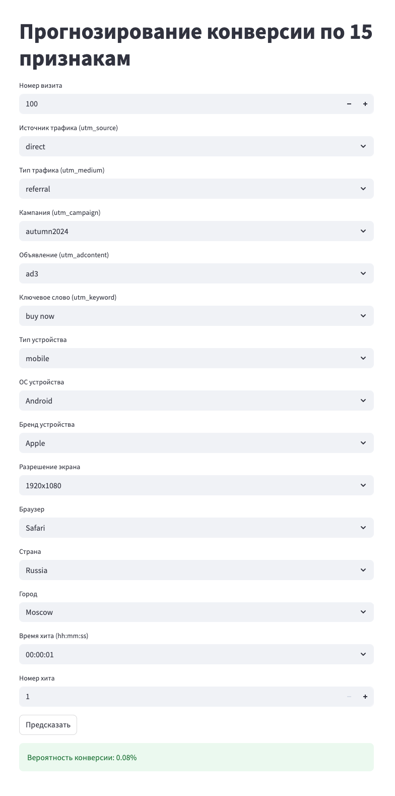

# Анализ поведения пользователей на сайте «СберАвтоподписка»

## Цель проекта

Разработка модели, предсказывающей вероятность того, что пользователь совершит **целевое действие** на сайте «СберАвтоподписка» (оставит заявку, закажет звонок и т.д.), на основе сессионных данных из Google Analytics.

**Функционал модели:**
- Оценка эффективности каналов трафика;
- Выявление поведенческих и технических признаков, связанных с конверсией;
- Вывод предсказания в веб-интерфейс для использования специалистами по маркетингу и UX.

**Планируемый Результат:**
модель бинарной классификации (целевое действие - да/нет), оцениваемая по метрике ROC-AUC.

---

## Описание данных

**Проект основан на двух источниках:**

1. ga_sessions.pkl - информация о визитах на сайт: описывают, кто, когда и откуда пришёл на сайт, через какой канал, с какого устройства.
Каждая строка - одна сессия (визит) пользователя 

Поля:
session_id, client_id, visit_date, visit_time, visit_number — идентификаторы и метки времени;
utm_* (source, medium, campaign, keyword) — рекламные источники (каким каналом пришёл);
device_* — характеристики устройства (тип, ОС, браузер, модель и т.п.);
geo_* — география пользователя (страна, город).

2. ga_hits.pkl — события внутри сессий: что делал пользователь во время визита, и произошло ли целевое действие.

Строка = одно действие пользователя в рамках одной сессии. 
Поля:
session_id, hit_date, hit_time, hit_number — идентификаторы и время события;
hit_type, hit_page_path, hit_referer — тип действия и путь страницы;
event_category, event_action, event_label, event_value — навигационные, кликовые, целевые действия (пример: нажатие на кнопку, просмотр формы, оформление заявки и т.п.).

**Целевая переменная (`target`)** создаётся на основе события: если в сессии присутствует одно из целевых действий. В качестве целевых действий выбраны события в ga_hits.pkl по полям event_category и event_action.
Примеры целевых действий:
- submit_form
- request_callback
- send_application
- order_button_click
- lead_conversion
- thank_you_page_view

**Логика выбора целевых действий и их связи с признаками:**

Каждое целевое действие (ЦД) - это результат взаимодействия пользователя с сайтом, каждое из них складывается из того, откуда он пришёл (так мы понимаем его мотивы - зачем заходил), с чего заходил (что-то без разницы на чём делать - на смартфоне или ПК, а что-то удобно делать только с десктопа), в какое время (например, посмотрел коротко в обеденный перерыв или нормально обстоятельно смотрел в свободное время вечером, может влиять регион (разный образ жизни, привычки, доступные ресурсы и т.д.). Мы предполагаем, что тот статус, который оказался записанным в event_action - это не случайность, а связано с тем, что пользователь делал до того, как ему был присвоен этот статус. Ниже описание гипотез, которые могут подтвердиться или нет (или мы получим другие пары ЦД и параметров, которые обнаружит моделька сама (например, CatBoost или LightGBM).

Подходящие ЦД, взятые из event_action:
1. submit_form (отправка формы на сайте) - влияет повторный это визит или первый, откуда пришёл (из рекламы или по прямой ссылке, т.к. уже знал её и бывал на сайте), с мобилки или деска (если форма большая, или в неё надо копировать и вставлять данные, то не будут заполнять с мобилки) - т.е. ожидаем, что на submit_form влияют:
- источник - utm_source, utm_medium
- девайс - device_*
- инфо о визите - visit_number
- гео - geo_*
2. request_callback (запрос обратного звонка) - например, может потребоваться
для финального принятия решения (не первый визит) - visit_number, 
если низкая комп. грамотность (извините, в регионах - geo_* или device_category)
как-то опосредованно будет связь с источниками визита utm_*.
3. order_button_click (заявка/заказ - инициирование, вызов формы для заполнения, которую может заполнить и отправить, а может - нет. Например, мог увидеть, что надо телефон или email оставить и решил не продолжать, или решил отложить)
- заполнил форму вечером в свободное время или в выходные - visit_*
- источник влияет - utm_*
- у человека просто деньги есть (device_category, device_brand, device_model, device_screen_resolution).
4. send_application (непосредственно заявка/заказ - заполнил форму, если она на сайте/в воронке есть, и отправил)
- может быть по спец предложению/промо/акции из рекламы или email (utm_*),
- деньги появились (visit_number + тоже utm_*, например, зашёл по прямой ссылке)
- долго думал и решился (visit_number, visit_time).
5. lead_conversion - этот пользователь нам уже знаком и есть история предыдущего взаимодействия (например, лид зашёл когда-то случайно из рекламы, тут вернулся - мы его узнали и дальше отслеживаем его действия - тут - могут сыграть любые признаки в любой комбинации).
- thank_you_page_view (человек перешёл на финальную страницу “Спасибо за заказ”, например, он не только оформил заказ, но ещё и оплатил его - т.е. дошёл до конца воронки) - тоже могут сказаться буквально все признаки, т.к. сюда могут дойти пользователи из любого сценария.

---

## Этапы реализации
1. Анализ и очистка данных
2. Визуализация и EDA
3. Проектирование и сравнение моделей

   А. Сценарий 1: CatBoost / LightGBM (с категорией как есть)
   - Категориальные признаки передаются напрямую;
   - Используется CatBoost с автоматической обработкой.
   
   Б. Сценарий 2: Классические модели (LogReg, DecisionTree)
   - Выделены Top-N категорий + "Other";
   - OneHotEncoding / TargetEncoding;
   - Обучены модели: Logistic Regression, Decision Tree, RandomForest.
5. Реализация предсказательной модели.

---

### Этапы 1-2. Анализ и очистка данных. Визуализация и EDA

Выполнено:
- Загрузка и изучение структуры `ga_sessions` и `ga_hits`;
- Обнаружение и обработка пропусков, дубликатов, аномалий;
- Объединение таблиц по `session_id`;
- Разметка целевой переменной `target`;
- Исследование категориальных признаков с большим количеством уникальных значений.
- Распределения по каналам трафика, устройствам, ОС, географии;
- Анализ числовых признаков (`visit_number`, `event_value`);
- Корреляционная матрица;
- Исследование признаков в разрезе `target`.

**Выводы по анализу данных**

1. Структура и полнота данных в целом удовлетворительная:
- Пропуски и некорректные значения встречаются локально (например, в utm_keyword, utm_campaign), но не критичны.
- Числовые и категориальные типы данных определены корректно, дубликатов не обнаружено.
- Данные по ga_sessions и ga_hits успешно объединены через session_id.

2. Целевая переменная (target) успешно размечена на основе событий:
- Использованы события event_action вроде submit_form, request_callback, lead, order_button_click.
- Баланс классов смещён в сторону 0, но уровень несбалансированности приемлем (примерно 1:4–1:5).

3. Распределения категориальных признаков показывают высокую неоднородность:
- Некоторые признаки (например, utm_source, device_category, device_os) имеют ограниченное число популярных значений;
- Другие (например, geo_city, utm_campaign) содержат десятки и сотни уникальных значений, что потребует группировки или encoding.


4. Числовые признаки содержат полезную информацию для модели:
- Признак visit_number имеет правостороннее распределение, что может сигнализировать о важности "постоянных" пользователей.
- Значения event_value сконцентрированы в нуле, но отдельные сессии демонстрируют аномально высокие значения — требуют отдельной обработки или логарифмирования.

Распределение признаков


5. Корреляционный анализ выявил слабые связи между числовыми признаками:
Корреляции между visit_number, event_value и target не высоки по модулю, но подтверждают, что влияние лучше выявлять нелинейными моделями.

График: корреляционная матрица (heatmap)


7. Предварительный EDA подтвердил обоснованность гипотез:
- Тип устройства, канал привлечения и город посещения влияют на вероятность совершения целевого действия;
- Некоторые источники (utm_source) и типы устройств (device_category) явно связаны с более высокой конверсией.

**Комментарии по отдельным характерным свойствам данных**

**1. География пользователей**

Почти все сессии происходят из России — признак geo_country не несёт разнообразной информации. Его можно упростить до Russia / Other.

График: TOP 10: geo_country — резкий перевес в сторону одного значения.


**2. Тип устройства, ОС и бренд**

- Большинство пользователей заходят с мобильных устройств (device_category);
- Доминирующие ОС — вероятно, Android/iOS;
- Популярные бренды: Apple, Samsung, Xiaomi;
- Все переменные потенциально важны для UX и маркетинговых гипотез.

Графики:
TOP 10: device_category — явное преобладание категории 1 (мобильные). TOP 10: device_os — распределение по ОС.


TOP 10: device_brand — визуальное распределение брендов. TOP 10: device_browser — покрытие браузеров (влияет на поведение и интерфейс).


**3. Поведение в сессии (действия и события)**

В действиях пользователей (event_action, event_category) есть сильные лидеры и длинный "хвост" редких значений;

- Есть смысл выделить Top-N значений и заменить остальные на Other;
- Поведение разнообразно, но концентрировано вокруг нескольких типов событий.

Графики:

TOP 10: event_action — два пиковых действия + множество редких;


TOP 10: event_category — один лидер и постепенное снижение;


Boxplot event_action и event_category подтверждают небольшую дисперсию у популярных значений.


**4. Источники и каналы трафика**

- Кампании (utm_campaign), источники (utm_source), содержимое объявлений (utm_adcontent) и каналы (utm_medium) демонстрируют сильную неравномерность;
- Преобладают 1–3 значения, остальное — шум;
Это ключевые бизнес-признаки, важно сохранить их семантическую ценность, применив Top-N.

График:

TOP 10: utm_source, utm_medium, utm_campaign, utm_adcontent — выраженные пики и длинные "хвосты".


**5. Технические признаки сессии и активности**

- Признаки visit_number, hit_number, hit_time сильно скошены вправо;
- Много выбросов, но это может быть связано с реальным поведением "лояльных" пользователей.

Графики:

Boxplot visit_number, hit_number и hit_time наглядно демонстрируют выбросы и скошенность.


---

### Этапы 3-4. Проектирование и выбор моделей. Реализация предсказательной модели

Этапы 3-4 включают
- Выбор и реализацию моделей. В рамках проекта мы тестируем две стратегии построения модели — с использованием бустинга и с классическими методами. Это позволяет нам сравнить подходы по качеству, интерпретируемости и трудозатратам на обработку данных.
- ROC-AUC и baseline accuracy рассчитаны для обеих стратегий;
- CatBoost показывает наилучшее качество без сложной обработки признаков;
- Финальная модель сохранена в `model.pkl`.

Мы выбрали две архитектуры модели для сравнения:

1. CatBoost с использованием категориальных признаков без кодирования (для быстрой реализации и интерпретируемости) - модель позволяет использовать признаки в полном исходном виде и тем самым учесть большое количество категорий;

2. Классические модели (Logistic Regression, Decision Tree) с предварительной обработкой категориальных признаков через стратегию Top-N + Other + OneHot.

Реализация:
- Поддержка обеих моделей через разные версии фрейма данных;
- Сравнение ROC-AUC на валидации;
- Выбор наиболее эффективной и использование для финальной модели в web-приложении.

Работающий фрагмент решения (код) можно найти по ссылке: [Uchebnaya_zadacha_komanda_4.ipynb](Uchebnaya_zadacha_komanda_4.ipynb)

---

**Сценарий 1: CatBoost (градиентный бустинг)**

Мы выбрали CatBoost как основной алгоритм бустинга по следующим причинам:
- Поддержка категориальных признаков "из коробки"  
  Модель обрабатывает категориальные переменные без необходимости ручного кодирования (one-hot, target encoding и т.д.), что позволяет избежать разрастания размерности и ошибок в обработке признаков.
- Устойчивость к переобучению и к дисбалансу классов
  CatBoost автоматически регулирует регуляризацию и может справляться с задачами, где один класс преобладает (что характерно для нашего target).
- Высокое качество на малых и средних выборках
  Учитывая ограниченный объём сессий (~десятки тысяч), CatBoost обеспечивает стабильную производительность даже без гиперпараметрического тюнинга.
- Интерпретируемость
  Модель позволяет анализировать важность признаков, что даёт полезную бизнес-информацию.

Пример использования:
```python
from catboost import CatBoostClassifier

cat_features = ['utm_source', 'utm_medium', 'device_category', 'device_os', 'geo_city']
model = CatBoostClassifier(cat_features=cat_features, random_seed=42)
model.fit(X_train, y_train)

**Сценарий 1: CatBoost / LightGBM (с категорией как есть)**
- Категориальные признаки передаются напрямую;
- Используется CatBoost с автоматической обработкой.

**Сценарий 2: Классические модели (LogReg, DecisionTree)**
- Выделены Top-N категорий + "Other";
- OneHotEncoding / TargetEncoding;
- Обучены модели: Logistic Regression, Decision Tree, RandomForest.
```

**Сценарий 2: Классические модели (Logistic Regression, Decision Tree)**
Параллельно мы реализуем стратегию с обработкой категориальных признаков через Top-N + Other + OneHotEncoding, после чего применяем классические алгоритмы.

Преимущества:
- Интерпретируемость логистической регрессии
Особенно важна в задачах, где нужно объяснить влияние отдельных признаков на вероятность конверсии.
- Быстрая тренировка и предсказание
Подходит для API с ограничением на скорость ответа (< 3 секунд).
- Контроль над признаками
Сокращение уникальных значений (Top-N) позволяет вручную контролировать важные категории, исключая шум из редких значений.
- Резервный сценарий
Классические модели позволяют быстро проверить baseline-качество и выступают как точка сравнения для более сложных решений.

Пример пайплайна
```python
from sklearn.pipeline import Pipeline
from sklearn.preprocessing import OneHotEncoder
from sklearn.linear_model import LogisticRegression

pipeline = Pipeline([
    ("encoder", OneHotEncoder(handle_unknown="ignore")),
    ("model", LogisticRegression(max_iter=1000))
])
pipeline.fit(X_train, y_train)
```

---

## Web-приложение для прогнозирования

Приложение позволяет ввести параметры сессии вручную и получить прогноз вероятности конверсии. Используется обученная модель `CatBoost`.

### Технологический стек

- **Язык программирования:** Python 3.10+
- **Фреймворк:** [Streamlit](https://streamlit.io/) — легковесное средство для быстрой сборки интерактивных веб-прототипов и интерфейсов.
- **ML-модель:** CatBoostClassifier, обученная на признаках сессий и действий пользователей.
- **Формат модели:** сериализована в файл `model.pkl` с использованием модуля `pickle`.
- **Ввод данных:** форма, состоящая из числовых полей, выпадающих списков и текстовых строк с базовой валидацией.

### Логика работы приложения

**Загрузка модели**
   - При запуске `app.py` из файла `model.pkl` подгружается обученная модель CatBoost.
   - Загрузка выполняется один раз при старте сессии:
     ```python
     with open(\"model.pkl\", \"rb\") as f:
         model = pickle.load(f)
     ```
### Ввод пользовательских данных
**Данные для прогноза**
   - Интерфейс формируется с помощью компонентов Streamlit:
     - `st.selectbox()` — для категориальных признаков (например, `utm_source`, `device_os`)
     - `st.number_input()` — для числовых признаков (`visit_number`, `hit_number`)
     - `st.text_input()` — для текстовых или закодированных значений
   - Пример:
     ```python
     utm_source = st.selectbox(\"Источник трафика\", [\"google\", \"direct\", \"yandex\", \"other\"])
     visit_number = st.number_input(\"Номер визита\", min_value=1, value=1)
     ```

**Вводимые параметры:**
1. Номер визита
2. Источник и тип трафика
3. Кампания и объявлени
4. Ключевое слово
5. Тип устройства, ОС, бренд
6. Разрешение и браузер
7. Страна и город
8. Время и номер хита

### Интерфейс:


Пример вывода:
> Вероятность конверсии: **0.08%**

---

### Запуск проекта

**Установка зависимостей**
```bash
pip install -r requirements.txt
```

**Запуск web-приложения**
```bash
streamlit run app.py
```

**Файл Streamlit-приложения для прогноза по 15 признакам**
```python

import streamlit as st
import pandas as pd
import pickle

# Загрузка модели
with open("model.pkl", "rb") as f:
    model = pickle.load(f)

st.set_page_config(page_title="Прогноз конверсии", layout="centered")
st.title("Прогнозирование конверсии по 15 признакам")

# Форма ввода признаков
visit_number = st.number_input("Номер визита", min_value=1, max_value=1000, value=100)
utm_source = st.selectbox("Источник трафика (utm_source)", ["direct", "google", "yandex", "other"])
utm_medium = st.selectbox("Тип трафика (utm_medium)", ["cpc", "banner", "referral", "other"])
utm_campaign = st.text_input("Кампания (utm_campaign)", "autumn2024")
utm_adcontent = st.text_input("Объявление (utm_adcontent)", "ad3")
utm_keyword = st.text_input("Ключевое слово (utm_keyword)", "buy now")
device_category = st.selectbox("Тип устройства", ["mobile", "desktop", "tablet"])
device_os = st.selectbox("ОС устройства", ["Android", "iOS", "Windows"])
device_brand = st.selectbox("Бренд устройства", ["Apple", "Samsung", "Xiaomi", "Huawei", "other"])
device_screen = st.text_input("Разрешение экрана", "1920x1080")
device_browser = st.selectbox("Браузер", ["Chrome", "Safari", "Firefox", "other"])
geo_country = st.selectbox("Страна", ["Russia", "Ukraine", "other"])
geo_city = st.text_input("Город", "Moscow")
hit_time = st.text_input("Время хита (hh:mm:ss)", "00:00:01")
hit_number = st.number_input("Номер хита", min_value=1, max_value=1000, value=1)

# Обработка и предсказание
if st.button("Предсказать"):
    # Формируем DataFrame
    df = pd.DataFrame([{
        "visit_number": visit_number,
        "utm_source": utm_source,
        "utm_medium": utm_medium,
        "utm_campaign": utm_campaign,
        "utm_adcontent": utm_adcontent,
        "utm_keyword": utm_keyword,
        "device_category": device_category,
        "device_os": device_os,
        "device_brand": device_brand,
        "device_screen": device_screen,
        "device_browser": device_browser,
        "geo_country": geo_country,
        "geo_city": geo_city,
        "hit_time": hit_time,
        "hit_number": hit_number
    }])

    # Предсказание
    prob = model.predict_proba(df)[0, 1] * 100
    st.success(f"Вероятность конверсии: {prob:.2f}%")

```
### Предсказание вероятности**
   - Модель возвращает вероятность конверсии:
     ```python
     prob = model.predict_proba(df)[0, 1]
     st.success(f\"Вероятность конверсии: {prob:.2%}\")
     ```
---

## Структура проекта
```
├── app.py                  # Web-интерфейс на Streamlit
├── model.pkl               # Сохраненная модель CatBoost
├── preprocessing.py        # Подготовка данных для модели
├── README.md               # Описание проекта
├── requirements.txt        # Зависимости
```

---

## Команда проекта
- Тимлид, проектирование решения: Екатерина Дорохова
- Аналитика данных: Ольга Емельянчук
- Преобработка данных: Иван Сойко
- ML-инженер: Владимир Гаврилов
- Frontend-интеграция: Андрей Максаков

---

## Лицензия
Проект создан в рамках учебного хакатона и предназначен для демонстрационных целей.

---

## Используемые технологии

- `pandas`, `numpy`, `matplotlib`, `seaborn`
- `scikit-learn`, `CatBoost`, `LightGBM`
- `streamlit` (web-интерфейс)
- `category_encoders` (для кодирования признаков)

---

## Прогресс команды

- [x] Чтение и анализ данных
- [x] Разметка целевой переменной
- [x] Визуализация и интерпретация признаков
- [x] Построение baseline моделей
- [x] Сравнение стратегий обработки категорий
- [x] Обучение и сохранение модели: реализовано частично, т.к. принято решение обучить несколько моделей различной архитектуры, чтобы сравнить их эффективность и выбрать оптимальную. На данный момент реализована одна из них.
- [x] Разработка web-интерфейса
- [x] Финальное тестирование и интеграция
